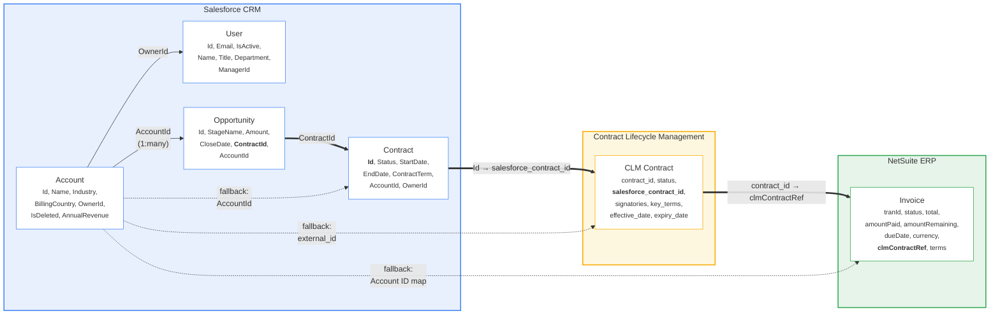

# Enterprise SaaS Onboarding Agent

An AI-powered customer onboarding automation agent built with **Pydantic AI + FastMCP**, demonstrating how autonomous agents can streamline enterprise SaaS onboarding workflows using native tool calling.

## 🎯 Overview

This agent automates the customer journey from **Sales → Contract → Invoice → Provisioning**, featuring:

- **Agentic Architecture**: The LLM reasons and decides which tools to call — no hardcoded state machine or graph
- **Native Tool Calling**: 28 tools registered via `@agent.tool` decorators; the agent orchestrates them autonomously
- **Cross-System Data Chaining**: Sequential Sales → Contract → CLM → Invoice lookups where each system's output feeds the next
- **Dual-Agent Design**: Onboarding agent (structured output) + CS Assistant agent (free-form chat for monitoring and actions)
- **Streamlit UI**: Dashboard with proactive alerts and suggested actions, portfolio overview, scenario runner, and interactive chat with multi-account commands
- **MCP-Style Extensibility**: Every tool is mirrored as a FastMCP server definition for future extraction to standalone services
- **Multi-System Integration**: Salesforce, CLM, NetSuite, currency conversion (live API), and SaaS provisioning
- **Customer Sentiment Analysis**: ML-powered scoring (DistilBERT transformer via PyTorch + HuggingFace) of customer interactions (emails, chat, support tickets) with trend detection, feeding into health assessments and risk identification
- **Post-Provisioning Monitoring**: Onboarding progress tracking, risk detection, task reminders, escalation tools, and portfolio-wide alerts
- **Proactive Alerts & Suggested Actions**: Automated risk surfacing with one-click actions that mutate onboarding/provisioning state, simulate CS remediation, and re-run blocked or escalated accounts
- **Closed-Loop CS Resolution**: The CS assistant can simulate that warnings/violations were resolved in source systems, then re-run onboarding to convert `BLOCK`/`ESCALATE` into `PROCEED`
- **Portfolio Management**: Aggregated health view across all accounts with priority actions and batch operations
- **Live Currency Conversion**: Historical and latest USD/CAD exchange rates via Frankfurter API (ECB data) for financial alignment checks
- **Financial Alignment Detection**: Automated comparison of opportunity deal values vs invoice totals across currencies (2% threshold)
- **Configurable Error Simulation**: Auth failures, permission errors, validation errors, rate limits, server errors with adjustable probabilities
- **Comprehensive Error Handling**: API errors are properly caught, recorded, and influence decisions
- **Proactive Notifications**: Slack and email alerts to stakeholders
- **Report Generation**: HTML emails, Markdown reports, JSON audit logs
- **Dual Observability**: Pydantic Logfire + LangSmith tracing (both opt-in), structured JSON logging, audit trails

<!-- ## 🎥 Video Demo Walkthrough

Watch the full solution walkthrough here:

👉 **[View Demo Video](https://drive.google.com/file/d/1-ztLnzh89_dahqyzBxzX045lJkn83hNs/view?usp=sharing)** -->


## 🏗️ Architecture

### Agentic Architecture

Unlike a traditional state machine or workflow engine, this agent uses **native LLM tool calling**. The LLM receives a system prompt with business rules and a set of tools, then autonomously reasons through the workflow:

```
Onboarding Agent (Pydantic AI — structured output)
  ├── Fetch Tools (6)        → Salesforce, CLM, NetSuite (with cross-system data chaining)
  ├── Validation Tools (2)   → Business rules, Financial alignment
  ├── Currency Tool (1)      → Historical/live exchange rates (Frankfurter API)
  ├── Provisioning (1)       → SaaS tenant creation
  ├── CS Monitoring (6)      → Progress tracking, risk detection, reminders, escalation, task updates, issue resolution
  ├── Sentiment Tools (2)    → Customer sentiment scoring (DistilBERT ML inference), interaction logging
  ├── Product Info (1)       → Tier config, SLA details, implementation prerequisites
  ├── Portfolio Tools (3)    → Portfolio overview, aggregated alerts, batch reminders
  └── Notification Tools (6) → Slack, Email, Welcome

CS Assistant Agent (Pydantic AI — free-form text, shares all 28 tools)
  └── Interactive chat for CS team to query status, identify risks, manage portfolio, and take batch actions
```

The agent decides **what to call, in what order, and how many times** based on tool results. Adding a new capability means registering a new `@agent.tool` — zero changes to orchestration logic. The workflow follows 5 mandatory steps for PROCEED accounts: **Gather Data → Validate → Decide → Act → Assess Risks & Sentiment**. Risk and sentiment assessment (`check_onboarding_progress`, `identify_onboarding_risks`, `get_customer_sentiment`) runs after every provisioning to detect post-provisioning risks and customer dissatisfaction — acting as a **predictive signal** that can flag an account as at-risk before task-level metrics show problems.

Each tool is also defined as a **FastMCP server** in `app/mcp/`, ready for extraction to standalone MCP services.

### Cross-System Data Chaining

Data flows sequentially across systems — each system's output provides lookup keys for the next:



**Bold arrows** show the primary chain: `Opportunity.ContractId` → `SF Contract.Id` → `CLM.salesforce_contract_id` → `Invoice.clmContractRef`. **Dotted arrows** show fallback account-based lookups used when a chaining field is missing.

### Architecture Diagram

```mermaid
---
config:
  theme: base
  themeVariables:
    background: '#ffffff'
    primaryColor: '#e8f0ff'
    primaryBorderColor: '#5b8def'
    lineColor: '#6b7a90'
    primaryTextColor: '#1f2937'
    clusterBkg: '#f7f9fc'
    clusterBorder: '#c7d0e0'
    fontSize: 13px
  flowchart:
    curve: basis
    nodeSpacing: 30
    rankSpacing: 40
---
flowchart LR
 subgraph TRIGGERS["1 · TRIGGER LAYER — How onboarding starts"]
    direction LR
        WH["fa:fa-bolt Salesforce Webhook\n(real-time)"]
        API["fa:fa-plug REST API / Manual\n(on-demand)"]
        BATCH["fa:fa-clock Scheduled Batch\n(nightly / periodic)"]
  end
 subgraph PARALLEL["Parallel fetches after account is loaded"]
    direction LR
        F_USER["fetch_salesforce\n_user\n(account owner)"]
        F_OPP["fetch_salesforce\n_opportunity\n(deal details)"]
  end
 subgraph CHAIN["Sequential chain: Sales → Contract → CLM → Invoice"]
    direction LR
        F_CON["fetch_salesforce\n_contract\n(via ContractId)"]
        F_CLM["fetch_clm\n_contract\n(via sf_contract_id)"]
        F_INV["fetch_netsuite\n_invoice\n(via clmContractRef)"]
  end
 subgraph FETCH["Step 1 · GATHER DATA — fetch from source systems"]
    direction TB
        F_ACC["fetch_salesforce_account\n(primary record)"]
        PARALLEL
        CHAIN
  end
 subgraph VALIDATE["Step 2 · VALIDATE — business rules + financial checks"]
    direction TB
        V_BIZ["validate_business_rules\n(5 domains · reads from deps)"]
        V_FIN["check_financial_alignment\n(cross-system · 2% threshold)"]
        V_CUR["convert_currency\n(historical ECB rate\nvia Frankfurter API)"]
  end
 subgraph ACT_B["BLOCK path — stop onboarding"]
    direction LR
        N_BLK["notify_blocked\n(Slack alert)"]
        N_FIN["notify_finance_overdue\n(finance team alert)"]
  end
 subgraph ACT_E["ESCALATE path — flag for review"]
        N_ESC["notify_escalation\n(CS team review)"]
  end
 subgraph ACT_P["PROCEED path — complete onboarding"]
    direction LR
        PROV["provision_account\n(activate services)"]
        N_SUC["notify_success\n(Slack confirmation)"]
        N_EMAIL["send_email\n(CS team summary)"]
        N_WEL["send_customer_welcome\n(welcome email)"]
  end
 subgraph ASSESS["Step 5 · ASSESS RISKS & SENTIMENT (mandatory for PROCEED)"]
    direction LR
        MON_PROG["check_onboarding\n_progress"]
        MON_RISK["identify_onboarding\n_risks"]
        MON_SENT["get_customer\n_sentiment"]
  end
 subgraph MONITOR["Post-provisioning actions"]
    direction LR
        MON_REM["send_task_reminder"]
        MON_ESC["escalate_stalled\n_onboarding"]
        MON_UPD["update_onboarding\n_task"]
  end
 subgraph PORTFOLIO["Portfolio management"]
    direction LR
        PORT_OV["get_portfolio\n_overview"]
        PORT_AL["get_all_alerts"]
        PORT_BA["batch_send\n_reminders"]
  end
 subgraph AGENT["2 · PYDANTIC AI AGENT — 28 tools via @agent.tool"]
        ENTRY["Initialize OnboardingDeps\n(account_id, correlation_id)"]
        FETCH
        VALIDATE
        DECIDE{"LLM DECISION POINT\nbased on tool results\n(errors / warnings / clear)"}
        ACT_B
        ACT_E
        ACT_P
        MONITOR
        PORTFOLIO
        OUTPUT["OnboardingResult\n(Pydantic structured output)"]
  end
 subgraph REPORTS["3 · GENERATED REPORTS — post-run artifacts"]
    direction LR
        R_MD["fa:fa-file-text Markdown\nReport"]
        R_HTML["fa:fa-envelope HTML\nEmail"]
        R_JSON["fa:fa-database JSON\nAudit Log"]
  end
 subgraph OBS["4 · OBSERVABILITY — opt-in tracing"]
    direction LR
        LOGFIRE["Pydantic Logfire\n(native tracing)"]
        LANGSMITH["LangSmith\n(OTEL bridge)"]
  end
 subgraph MCP["5 · FASTMCP SERVERS — app/mcp/"]
    direction TB
        MCP_SF["salesforce_server\n(accounts, users,\nopps, contracts)"]
        MCP_CLM["clm_server\n(contract lifecycle)"]
        MCP_NS["netsuite_server\n(invoices, payments)"]
        MCP_CUR["currency_server\n(FX conversion)"]
        MCP_PRV["provisioning_server\n(account activation)"]
        MCP_NOT["notifications_server\n(Slack, email)"]
        MCP_VAL["validation_server\n(business rules)"]
        MCP_SENT["sentiment_server\n(customer sentiment)"]
  end
 subgraph EXT["6 · EXTERNAL SYSTEMS — third-party integrations"]
    direction TB
        SF["fa:fa-cloud Salesforce CRM\n(Account · Opportunity\nUser · Contract)"]
        CLM_EXT["fa:fa-file-contract CLM\n(Contract Lifecycle Mgmt)"]
        NS["fa:fa-calculator NetSuite ERP\n(Invoices · Payments)"]
        FX["fa:fa-exchange Frankfurter API\n(ECB exchange rates)"]
        SLACK["fa:fa-comments Slack\n(Notifications)"]
        EMAIL_EXT["fa:fa-envelope Email\n(Welcome · CS alerts)"]
  end
    TRIGGERS -- account_id + correlation_id --> ENTRY
    ENTRY --> F_ACC
    F_ACC -- OwnerId --> F_USER
    F_ACC --> F_OPP
    F_OPP -- ContractId --> F_CON
    F_CON -- sf_contract_id --> F_CLM
    F_CLM -- clmContractRef --> F_INV
    FETCH --> V_BIZ
    V_BIZ --> V_FIN
    V_FIN -. if currencies differ .-> V_CUR
    VALIDATE --> DECIDE
    DECIDE -- errors or\nviolations --> ACT_B
    DECIDE -- "warnings only\n(non-critical)" --> ACT_E
    DECIDE -- all clear\n(no issues) --> ACT_P
    ACT_B --> OUTPUT
    ACT_E --> OUTPUT
    ACT_P -- post-provisioning --> ASSESS
    ASSESS --> MONITOR
    ASSESS --> OUTPUT
    MONITOR --> OUTPUT
    PORTFOLIO -. "portfolio-wide\n(CS assistant)" .-> OUTPUT
    OUTPUT --> REPORTS
    AGENT -.-> OBS
    AGENT -. every tool mirrored as FastMCP server .-> MCP
    MCP --> EXT

     WH:::trigger
     API:::trigger
     BATCH:::trigger
     F_USER:::fetch
     F_OPP:::fetch
     F_CON:::fetch
     F_CLM:::fetch
     F_INV:::fetch
     F_ACC:::fetch
     V_BIZ:::validate
     V_FIN:::validate
     V_CUR:::validate
     N_BLK:::block
     N_FIN:::block
     N_ESC:::escalate
     PROV:::proceed
     N_SUC:::proceed
     N_EMAIL:::proceed
     N_WEL:::proceed
     ENTRY:::entry
     DECIDE:::decision
     OUTPUT:::output
     R_MD:::report
     R_HTML:::report
     R_JSON:::report
     LOGFIRE:::obs
     LANGSMITH:::obs
     MCP_SF:::mcp
     MCP_CLM:::mcp
     MCP_NS:::mcp
     MCP_CUR:::mcp
     MCP_PRV:::mcp
     MCP_NOT:::mcp
     MCP_VAL:::mcp
     MCP_SENT:::mcp
     MON_SENT:::monitor
     MON_PROG:::monitor
     MON_RISK:::monitor
     MON_REM:::monitor
     MON_ESC:::monitor
     MON_UPD:::monitor
     PORT_OV:::portfolio
     PORT_AL:::portfolio
     PORT_BA:::portfolio
     SF:::ext
     CLM_EXT:::ext
     NS:::ext
     FX:::ext
     SLACK:::ext
     EMAIL_EXT:::ext
    classDef trigger   fill:#fff3cd,stroke:#d4a017,stroke-width:2px,color:#1f2937
    classDef entry     fill:#e8f0ff,stroke:#5b8def,stroke-width:2px,color:#1f2937
    classDef fetch     fill:#e6f7ee,stroke:#2e9d69,stroke-width:1px,color:#1f2937
    classDef validate  fill:#f1ecff,stroke:#8b7cf6,stroke-width:1px,color:#1f2937
    classDef decision  fill:#fff7db,stroke:#d4a017,stroke-width:2px,color:#1f2937
    classDef block     fill:#fde8e8,stroke:#e5484d,stroke-width:1px,color:#1f2937
    classDef escalate  fill:#fff3cd,stroke:#d4a017,stroke-width:1px,color:#1f2937
    classDef proceed   fill:#e6f7ee,stroke:#2e9d69,stroke-width:1px,color:#1f2937
    classDef output    fill:#e8f0ff,stroke:#5b8def,stroke-width:2px,color:#1f2937
    classDef report    fill:#f5f5f5,stroke:#999,stroke-width:1px,color:#1f2937
    classDef mcp       fill:#f0f0f0,stroke:#888,stroke-width:1px,stroke-dasharray:5 5,color:#555
    classDef ext       fill:#dbeafe,stroke:#3b82f6,stroke-width:1px,color:#1f2937
    classDef obs       fill:#fef3c7,stroke:#d97706,stroke-width:1px,stroke-dasharray:5 5,color:#92400e
    classDef monitor   fill:#e0f2fe,stroke:#0284c7,stroke-width:1px,color:#1f2937
    classDef portfolio fill:#fce7f3,stroke:#db2777,stroke-width:1px,color:#1f2937
```



### Decision Logic

The agent makes decisions based on three factors:

1. **API Errors** (`api_errors`): System integration failures (auth, rate limits, server errors) → **BLOCK**
2. **Violations** (`violations`): Business rule failures (missing data, invalid states) → **BLOCK**
3. **Warnings** (`warnings`): Non-critical issues (missing optional fields, FX gaps, underpayment) → **ESCALATE**
4. **All Clear**: No errors, violations, or warnings → **PROCEED**

For **PROCEED** accounts, the agent then runs mandatory risk and sentiment assessment (step 5): `check_onboarding_progress`, `identify_onboarding_risks`, and `get_customer_sentiment`. Findings are included in the final `OnboardingResult`.

## 🚀 Quick Start

### Prerequisites

- Python 3.11+
- [uv](https://docs.astral.sh/uv/) (recommended) or pip
- OpenAI API key (recommended; falls back to Ollama local model without it)
- LangSmith API key (optional — for tracing)
- Logfire token (optional — for Pydantic AI native tracing)

## 📦 Installation

### Option 1: Using `uv` (Recommended - Faster)

[`uv`](https://docs.astral.sh/uv/) is a fast Python package installer and environment manager.

**macOS / Linux**
```bash
curl -LsSf https://astral.sh/uv/install.sh | sh
```

**Windows (PowerShell)**
```powershell
powershell -ExecutionPolicy ByPass -c "irm https://astral.sh/uv/install.ps1 | iex"
```

**Project setup**
```bash
# Initialize project and virtual environment
uv init

# Install dependencies
uv add -r requirements.txt

# Environment variables
cp .env.example .env
# Edit .env with your API keys
```

---

### Option 2: Using pip (Standard Python)

```bash
# Create virtual environment
python -m venv venv

# Activate virtual environment
# macOS / Linux
source venv/bin/activate
# Windows
venv\Scripts\activate
```

```bash
# Install dependencies
pip install -r requirements.txt

# Environment variables
cp .env.example .env
# Edit .env with your API keys
```

---

### Environment Variables

Create a `.env` file in the project root (or copy from `.env.example`):

```env
# ============================================================
# OpenAI — Required for best results
# Get your API key from https://platform.openai.com/api-keys
# Without this, the agent falls back to a local Ollama model.
# ============================================================
OPENAI_API_KEY=sk-your-api-key-here
OPENAI_MODEL=gpt-4o-mini          # Any OpenAI chat model works here

# ============================================================
# Ollama — Local model fallback (no API key required)
# Used automatically when OPENAI_API_KEY is not set.
# Requires a running Ollama server: https://ollama.com
# ============================================================
OLLAMA_MODEL=llama3.2

# ============================================================
# LangSmith — Optional agent tracing
# Traces Pydantic AI agent runs, tool calls, and LLM completions
# via an OpenTelemetry bridge. Get keys: https://smith.langchain.com
# ============================================================
LANGCHAIN_TRACING_V2=true
LANGCHAIN_API_KEY=ls-your-langsmith-api-key-here
LANGCHAIN_PROJECT=onboarding-agent
LANGCHAIN_ENDPOINT=https://api.smith.langchain.com

# ============================================================
# Logfire — Optional Pydantic AI native tracing
# Provides native visibility into agent reasoning chains and
# structured output validation. Get token: https://logfire.pydantic.dev
# ============================================================
LOGFIRE_TOKEN=
LOGFIRE_ENVIRONMENT=development

# ============================================================
# Application
# ============================================================
LOG_DIR=logs           # Directory for structured JSON logs
ENVIRONMENT=development
```

---

## ▶️ Running the Application

Two processes must run simultaneously in separate terminals: the **FastAPI backend** and the **Streamlit UI**.

### 1. Start the FastAPI Backend

```bash
uv run main.py   # uv
# OR
python main.py   # pip
```

Runs on `http://localhost:8000` — interactive API docs at `http://localhost:8000/docs`.

### 2. Start the Streamlit UI (new terminal)

```bash
uv run streamlit run streamlit_app.py   # uv
# OR
streamlit run streamlit_app.py          # pip
```

Opens at `http://localhost:8501`. The UI requires the FastAPI backend to be running first.

---

## 📋 Demo Scenarios

### Normal Scenarios

| Account ID | Scenario | Expected Decision | Post-Provisioning Simulation |
|------------|----------|-------------------|------------------------------|
| ACME-001 | Happy Path — Full Success | ✅ PROCEED | — |
| BETA-002 | Opportunity Not Won | 🚫 BLOCK | — |
| GAMMA-003 | Overdue Invoice | ⚠️ ESCALATE | — |
| DELETED-004 | Deleted Account | 🚫 BLOCK | — |
| MISSING-999 | Account Not Found | 🚫 BLOCK | — |
| FOREX-005 | FX Invoice Mismatch (CAD vs USD) | ⚠️ ESCALATE | — |
| PARTIAL-006 | Partial Payment Gap (5% underpayment) | ⚠️ ESCALATE | — |
| STARTER-007 | Proceed — Customer Not Logged In | ✅ PROCEED | `no_login` — 5 days since provisioning, customer hasn't logged in |
| GROWTH-008 | Proceed — Stalled Onboarding | ✅ PROCEED | `stalled` — 10 days in, <30% complete, kickoff not done |
| ENTERPRISE-009 | Proceed — SSO & Blocked Tasks | ✅ PROCEED | `blocked_sso` — 8 days in, SSO blocked, multiple tasks overdue |

**FOREX-005** demonstrates historical currency conversion: the invoice is in CAD ($145,000) while the opportunity is in USD ($100,000). The conversion uses the ECB rate from the invoice date (2024-03-01), not today's rate, ensuring financial accuracy. The resulting gap exceeds the 2% threshold, triggering escalation.

**PARTIAL-006** demonstrates underpayment detection: $190,000 paid of a $200,000 invoice (5% gap) exceeds the 2% financial alignment threshold.

**STARTER-007 / GROWTH-008 / ENTERPRISE-009** are PROCEED scenarios with post-provisioning simulation that backdates the provisioning timestamp and manipulates task states to create realistic onboarding risk conditions. These power the proactive alerts, suggested actions, and portfolio overview features.

**BETA-002 / DELETED-004 / MISSING-999 / FOREX-005 / PARTIAL-006** also demonstrate the remediation loop required for a production-minded CS assistant. When a CS user approves the suggested action, the backend now simulates upstream fixes in Salesforce, CLM, and/or NetSuite, then re-runs onboarding so the account can actually move from `BLOCK` or `ESCALATE` into `PROCEED` and provisioning.

### Error Simulation

Enable configurable error injection to test resilience:

```bash
# Enable 100% auth error rate
POST /demo/enable-random-errors?auth_rate=1.0

# Enable mixed error rates
POST /demo/enable-random-errors?auth_rate=0.1&rate_limit_rate=0.2&server_error_rate=0.05

# Check current simulator status
GET /demo/error-simulator-status

# Disable error simulation
POST /demo/disable-random-errors
```

| Error Type | Description | HTTP Code |
|------------|-------------|-----------|
| `auth_rate` | Authentication failures | 401 |
| `validation_rate` | Validation errors | 400 |
| `rate_limit_rate` | Rate limit exceeded | 429 |
| `server_error_rate` | Server errors | 500 |

## 🔧 Error Handling

### Key Error Handling Features

1. **In-Place Error Simulator Modification**: The `ERROR_SIMULATOR` object is modified in-place when enabled, ensuring all modules reference the same instance.

2. **Comprehensive Error Catching**: Each integration module catches both specific error types AND generic `APIError` as a fallback.

3. **Error-Aware Decision Making**: The `make_decision` function checks `api_errors` first, ensuring system failures block onboarding.

4. **Error Details in Reports**: API errors are added to violations and appear in generated reports with full context.

## 📊 Generated Reports

The agent generates professional reports for each run:

- **HTML Email Templates** - Blocked notifications, escalation notifications, success notifications, welcome emails
- **Markdown Reports** - Complete run summary with violations, warnings, API errors, and actions
- **JSON Audit Logs** - Machine-readable audit trail with full state

## 📋 Onboarding Task Management

When an account is provisioned, the agent automatically creates a **granular onboarding task checklist** that tracks the CS workflow:

### Task Categories

| Category | Owner | Examples |
|----------|-------|----------|
| **Automated** | System | Create tenant, generate API credentials, send welcome email |
| **CS Action** | CS Team | Schedule kickoff call, configure SSO, create custom reports |
| **Customer Action** | Customer | Verify login, complete platform tour, invite team members |
| **Technical** | CS Team | SSO integration, API setup |

### Example Task Flow

```
1. ✅ Create Tenant (system - auto-completed)
2. ✅ Generate API Credentials (system - auto-completed)
3. ✅ Send Welcome Email (system - auto-completed)
4. ✅ Send Training Materials (system - auto-completed)
5. ⏳ Schedule Kickoff Call (cs_team - pending, due in 1 day)
6. ⏳ Verify Login Access (customer - pending, due in 2 days)
7. ⏳ Conduct Kickoff Call (cs_team - pending, due in 3 days)
8. ⏳ Complete Platform Tour (customer - pending, due in 5 days)
...
14. ⏳ Onboarding Complete (cs_team - pending, due in 45 days)
```

## 🎭 Customer Sentiment Analysis

The agent includes a **sentiment analysis system** powered by a **DistilBERT transformer model** (`distilbert-base-uncased-finetuned-sst-2-english`) via PyTorch and HuggingFace Transformers. It scores customer interactions and feeds signals into health assessments and risk detection — enabling CS teams to act before tasks actually stall.

### How It Works

1. **Interaction Tracking**: Customer communications (emails, chat messages, support tickets) are logged with channel, direction, and author metadata
2. **ML Model Inference**: Each inbound customer message is scored from **-1.0** (very negative) to **+1.0** (very positive) using a fine-tuned DistilBERT model. The model returns POSITIVE/NEGATIVE label probabilities which are mapped to the score range (e.g., POSITIVE 0.95 → +0.95, NEGATIVE 0.80 → -0.80). Falls back to keyword-based scoring if PyTorch/Transformers are not installed
3. **Aggregate Score**: Per-account scores are averaged across all inbound customer messages, producing a label: `positive` (≥ 0.3), `neutral`, or `negative` (≤ -0.3)
4. **Trend Detection**: Compares the average score of the older half vs. newer half of interactions to determine if sentiment is `improving`, `stable`, or `declining` (threshold: ±0.15 delta)
5. **Model Transparency**: The API response includes a `model` field indicating which scorer was used (`distilbert-base-uncased-finetuned-sst-2-english` or `keyword-fallback`)

### Integration with Health Assessment

Sentiment feeds directly into two systems:

- **Health Status** (`check_onboarding_progress`): A `negative` sentiment label shifts the account health to `at_risk`, even if task completion metrics look normal
- **Risk Detection** (`identify_onboarding_risks`): Negative sentiment generates a `high` severity risk if the trend is declining, or `medium` otherwise. A declining trend alone (even with neutral score) generates a `medium` risk

### Seed Data for Demo Scenarios

| Account | Profile | Sentiment Pattern |
|---------|---------|-------------------|
| ACME-001 | Happy path | Positive — grateful, engaged customer |
| STARTER-007 | `no_login` | Negative — frustrated about login access delays |
| GROWTH-008 | `stalled` | Negative — disappointed, losing confidence, considering alternatives |
| ENTERPRISE-009 | `blocked_sso` | Mixed — positive kickoff, then frustrated about SSO delays |

### Suggested Actions

When negative sentiment is detected, the proactive alerts system generates a **"Schedule check-in call"** suggested action. Approving it simulates a CS outreach call and a positive customer response, improving the sentiment score.

### Agent Tools

| Tool | Description |
|------|-------------|
| `get_customer_sentiment` | Returns aggregate score, label, trend, and recent interaction scores for an account |
| `log_customer_interaction` | Records a new interaction (email/chat/support_ticket/call) for ongoing sentiment tracking |

## 💬 CS Assistant & Streamlit UI

The project includes a **dual-agent architecture** and a **Streamlit UI** for interactive use:

### CS Assistant Agent

A second agent (`cs_assistant_agent`) shares all 28 tools but returns free-form text instead of structured output. It enables CS managers to interact conversationally:

- "What's the onboarding progress for ACME-001?"
- "Are there any risks with this account?"
- "Send a reminder about the login task"
- "Escalate this onboarding — customer is unresponsive"
- "Show me all at-risk accounts"
- "What's my most urgent account?"
- "Send reminders to all overdue tasks"
- "Give me a daily summary of all my accounts"

The assistant retains conversation history across messages within a session.

### Streamlit UI (4 pages)

| Page | Description |
|------|-------------|
| **Dashboard** | Proactive alerts grouped by account, smart suggested actions with approve/dismiss, all onboarding results grouped by decision with health badges and expandable details |
| **Portfolio Overview** | Aggregated health metrics (On Track/At Risk/Stalled/Blocked/Escalated), priority actions today, and sortable account table |
| **Run Onboarding** | Scenario selector, run button, tabbed results (violations/warnings/actions/risks with sentiment scoring/provisioning with live progress) |
| **Chat with Agent** | Interactive chat with the CS assistant, account dropdown selector, portfolio-level quick actions (Portfolio Summary, All Alerts, Send All Reminders), and per-account actions |

### CS Monitoring Tools (6 tools)

| Tool | Description |
|------|-------------|
| `check_onboarding_progress` | Completion %, task breakdown, health status (on_track/at_risk/stalled), sentiment signal |
| `identify_onboarding_risks` | Detects: no login after 3 days, SSO not configured, tasks blocked, stalling, overdue actions, negative sentiment |
| `send_task_reminder` | Sends reminder to task owner (customer or CS team) |
| `escalate_stalled_onboarding` | Posts to #cs-onboarding-escalations with progress snapshot |
| `update_onboarding_task` | Update task status (pending/in_progress/completed/blocked/skipped) |
| `simulate_issue_resolution` | Simulate that upstream warnings/violations were resolved, then allow a safe onboarding re-run |

### Product Info Tool (1 tool)

| Tool | Description |
|------|-------------|
| `lookup_product_info` | Tier configuration (features, limits, storage), SLA details, contractual terms, and implementation prerequisites per tier |

### Portfolio Management Tools (3 tools)

| Tool | Description |
|------|-------------|
| `get_portfolio_overview` | Aggregated health distribution, account list with completion %, and top priority actions across all accounts |
| `get_all_alerts` | All risk alerts across the portfolio, sorted by severity (critical > high > medium > low) |
| `batch_send_reminders` | Sends reminders to all accounts matching a filter (overdue tasks, no login, or stalled onboardings) |

## 📁 Project Structure

```
Enterprise-Agents-Solutions-Case-Study/
├── main.py                               # FastAPI application + tracing setup
├── streamlit_app.py                      # Streamlit UI (Dashboard, Run, Chat)
│
├── solution_design/                      # Architecture & technical design assets
│   ├── Solution_Design_Document.pdf
│   └── ...
│
├── reports_output/                       # Generated reports directory
├── logs/                                 # Runtime logs
│
└── app/
    ├── agent/                            # Pydantic AI agents
    │   ├── __init__.py                   # run_onboarding_async() entry point
    │   ├── onboarding_agent.py           # Onboarding agent (28 tools) + CS assistant agent
    │   ├── dependencies.py               # OnboardingDeps (runtime context)
    │   ├── models.py                     # OnboardingResult (structured output)
    │   ├── state_utils.py                # State manipulation utilities
    │   └── invariants/                   # Business rule validators
    │
    ├── mcp/                              # FastMCP server definitions
    │   ├── salesforce_server.py          # Salesforce tools as MCP
    │   ├── clm_server.py                 # CLM tools as MCP
    │   ├── netsuite_server.py            # NetSuite tools as MCP
    │   ├── currency_server.py            # Currency conversion as MCP
    │   ├── provisioning_server.py        # Provisioning + monitoring tools as MCP
    │   ├── notifications_server.py       # Notification tools as MCP
    │   ├── validation_server.py          # Validation tools as MCP
    │   └── sentiment_server.py          # Sentiment analysis tools as MCP
    │
    ├── api/                              # REST endpoints
    │   ├── demo.py                       # Demo, monitoring, chat endpoints
    │   └── webhook.py                    # Webhook handlers
    │
    ├── integrations/                     # Mock API clients
    │   ├── salesforce.py                 # Salesforce CRM (accounts, opps, contracts)
    │   ├── clm.py                        # CLM (with salesforce_contract_id cross-ref)
    │   ├── netsuite.py                   # NetSuite ERP (with clmContractRef cross-ref)
    │   ├── currency.py                   # Currency conversion with historical rates (Frankfurter API)
    │   ├── provisioning.py               # Provisioning + monitoring/risk/escalation
    │   ├── sentiment.py                  # Sentiment analysis (DistilBERT ML inference + keyword fallback)
    │   └── api_errors.py                 # Error hierarchy + simulator
    │
    ├── tracing.py                        # Dual tracing setup (Logfire + LangSmith)
    │
    ├── llm/                              # LLM integration
    │   └── risk_analyzer.py
    │
    ├── notifications/                    # Slack / Email
    ├── reports/                          # Report generation
    └── logging/                          # Structured logging
```

## 🔒 Security Patterns Demonstrated

All integrations in this project are mocked, but they demonstrate the following production security patterns:

- **OAuth simulation** with token expiry and refresh flows
- **Permission checking** before every API call (role-based access control)
- **Credential validation** with distinct error types for expired vs invalid tokens
- **Audit logging** with correlation IDs for end-to-end traceability
- **Error masking** — no sensitive data (tokens, secrets) exposed in API responses or reports

## 📊 Observability

The agent supports **dual tracing** — both are opt-in via environment variables and can run simultaneously:

**Pydantic Logfire** (set `LOGFIRE_TOKEN`):
- Native Pydantic AI agent tracing
- Full reasoning chain, tool calls with inputs/outputs, structured output validation
- Dashboard at [logfire.pydantic.dev](https://logfire.pydantic.dev)

**LangSmith** (set `LANGCHAIN_API_KEY`):
- Agent execution runs, tool invocations, LLM completions
- Viewable under the "onboarding-agent" project in the LangSmith dashboard
- Uses the OpenTelemetry bridge (`langsmith.integrations.otel`)

## 🚧 Areas for Improvement

The following features would enhance the agent for production use:

### Current Limitations

| Limitation | Current State | Production Enhancement |
|------------|---------------|----------------------|
| **No human-in-the-loop approval** | Suggested Actions panel provides approve/dismiss UI for risk-derived actions; blocked/escalated accounts can now be remediated and re-run from the UI/API | Add Slack interactive buttons for approve/reject before provisioning |
| **Event-driven task completion** | Tasks must be manually marked complete via API | Integrate webhooks from SaaS platform to auto-complete when customer takes action |
| **No customer-facing portal** | Customer can't see their onboarding progress | Build React dashboard showing task checklist and status |
| **Single workflow execution** | Agent runs once per trigger | Add retry/resume capability for failed workflows |
| **In-memory state** | Provisioning/chat history lost on restart | Add persistent database (PostgreSQL) for production |

### Suggested Enhancements

For detailed production enhancements (23 items with implementation ideas, Salesforce/NetSuite API references, and decision logic), see the **[Production Roadmap](production_roadmap/)**.

| Category | Enhancements | Focus |
|----------|:---:|-------|
| **Workflow & Notifications** | 3 | Task monitoring (partially implemented), escalation hierarchy (partially implemented), approval workflows |
| **Event-Driven Integration** | 2 | Webhook-based task completion, optimized batch fetching |
| **Salesforce & CRM Scenarios** | 5 | Account hierarchies, multi-opportunity handling, owner validation, stale deal detection |
| **Invoice & Financial Scenarios** | 4 | Installments, credit memos, payment discounts, cross-system reconciliation (multi-currency with historical rates and underpayment detection now implemented) |
| **Frontend & Observability** | 1 | ~~Real-time CS dashboard~~ implemented via Streamlit UI |
| **LLM Resilience & Multi-Model Fallback** | 2 | Secondary LLM providers, unified gateway via LiteLLM |
| **RAG & Context Engineering** | 2 | Vector-based retrieval for risk analysis, historical predictive scoring |
| **Multi-Agent Architecture** | 2 | MCP server integration with A2A protocol for agent-to-agent collaboration, and credential management and trust boundaries |
